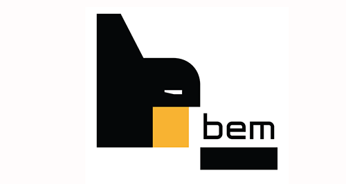

### Hi there, I`m Oleh👋

#### Projects

- [WebStudio](https://deoneshka.github.io/goit-markup-hw-08/index.html) (html5, css3, sass) - a website with a responsive layout.
- [HellEN](https://deoneshka.github.io/goit-team-project-html-css/) (html5, css3, sass) - a website with a responsive layout. Role - developer (header).
- [Filmoteka](https://deoneshka.github.io/goit-team-project-js/) (html5, css3, sass, vanilla js, rest api, ajax, webpack) - application for choosing a movie. Role - developer (pagination).
- [Image-finder](https://deoneshka.github.io/goit-react-hw-03-image-finder/) (react) - application for displaying images by keyword using Pixabay API.
- [Phonebook](https://deoneshka-goit-react-hw-09-phonebook.netlify.app/login) (react, redux, axios) - phonebook application for saving user's contacts.
- [Wallet](https://wallet-tpb.netlify.app/login) (html5, css3, sass, react, redux, axios, node.js, mongodb) - application for fixing the user's expenses and income. Role - front end developer (transaction, statistics).

#### My stack and tools

